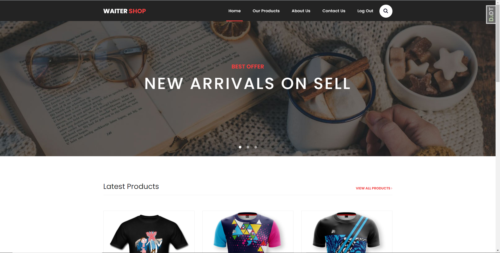
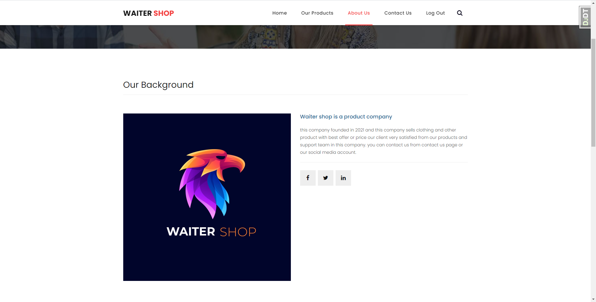

# WaiterShop
WaiterShop is a simple shop application with RESTAPI, where users can buy products .

##  How to run the app
1. Either fork or download the app and open the folder in the cli
2. Install all dependencies using the `pip install requirements.txt` command (recomended : use virtualenv)
3. Start the web server using the `python manage.py runserver` command. The app will be served at http://localhost:8000/ 
4. Go to http://localhost:8000/ in your browser and tweet something

## How buy products
1. In home or our products page click on one item
2. you should see price and detail of those item
3. if you want it, click add to cart
4. login to site
5. you can back to products page with continue shopping botton and add other items in your cart
6. or click on proceed to checkout for buy your cart items
7. fill your shipping adress form
8. if you have shipping address in site,you can use Use default shipping address checkbox
9. choice your payment option
10. click continue to checkout

## User Stories
- A user can rate products if logged in .
- A user can have refund request on 'request-refund/' endpoint .
- A user can have coupon for reduce the price .
- A user can search products on top navigation .

## Features
  
- category
  - items ordered by category
  - can click on category name and just see items for those category

  

## Dependencies
- Python
- Django
- SQLite
- DRF
- Django Packages

## What the app looks like

